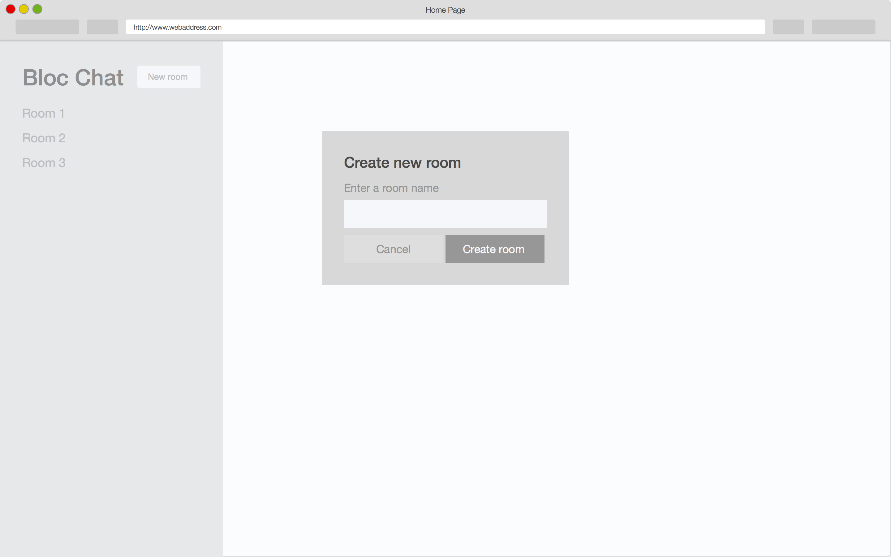
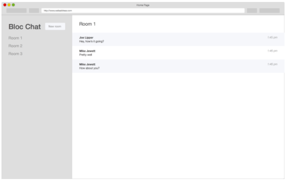

# Chatty Chat

###Overview
Chatty Chat is a live chat room application that uses Angular JS two-way data binding with Firebase. Results in a threeway synchronization to send and receive  messages in real time.


- Users can see a list of **avaiable chat rooms**
- Users can **create** chat rooms
- Users can see a **list of messages** in each chat room
- Users can set his/her **username** to display in chat rooms
- Users can **send messages** associated with his/her username in a chat room



###List Chat Rooms
In Firebase, rooms are created like this:
```
  bloc-chat-1482f
  |__rooms
      |__1:"room1"
      |__2:"room2"
      |__3:"room3"
```
A `Room` factory in Angular defines all Room-related API queries. A reference is creaked inside of Firebase database, and `$firebaseArray` service is injected.
```javascript
  (function() {
    function Room($firebaseArray) {
      var ref = firebase.database().ref();
    }

    angular
      .module('blocChat')
      .factory('Room', ['$firebaseArray', Room]);
  })();
```
To display queried Rooms in the view. A controller is created and associated with the home template in a `$state`. Using `ng-repeat`, a list of rooms are displayed in the template.

###Create Chat Rooms
AngularFire has `$add()` method that we can use to create and retrieve with the `$firebaseArray` service. In this case, the array is the data stored in the `rooms` variable in the `Room` service. 
Useing UI Bootstraps `$uibModal` service, I defined a method for toggling a modal on the frontend to submit the new room's data using `ngclick` or `ngSubmit`. 

###List Messages


A list of messages are helt in a container to the right of the list of avaiable chat rooms. The active room is stored in a `$scope` object in the main controller, so the title of the active room changes every time you visit a different room. The active room is triggered by clicking on the name of the room in the sidebar.
To associate messages with room id, each message object in the Firebase database should have four properties:
```
  {
      username: "<USERNAME HERE>",
      content: "<CONTENT OF THE MESSAGE HERE>",
      sentAt: "<TIME MESSAGE WAS SENT HERE>",
      roomId: "<ROOM UID HERE>"
  }

```
The last property, `roomId`, references the room where the message was sent. The ID is generated every time an object saves to Firebase, and can be viewed on the Firebase web interface.

###Set Username
Angular cookies module is included via a `<script>` tag in `index.html`, and the `ngCookies` modul needs to be injected into Anuglar app's dependency array. Using `.run()` block, a username is set at the time the app is initialized. 
```
  (function() {
    function BlocChatCookies($cookies) {
      var currentUser = $cookies.get('blocChatCurrentUser');
      if (!currentUser || currentUser === '') {
        ...
      }
    }

    angular
      .module('blocChat')
      .run(['$cookies', BlocChatCookies]);
  })();
```

###Send Messages
A `send` method is added to `Message` factory. To make sure the messages are associated with their username, we can propulate the username with the current user's username by injecting the `$cookies` service and referencing the current user object on it.
